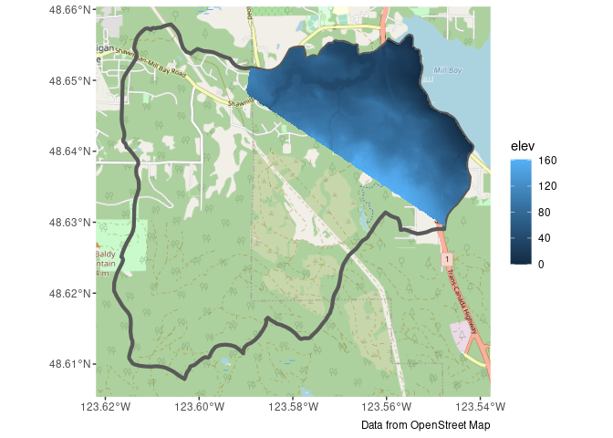
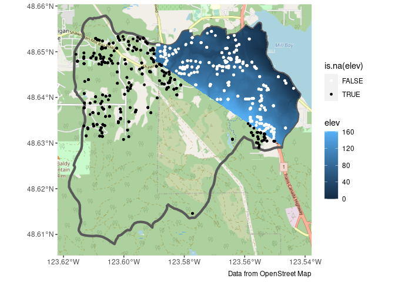

# bcaquiferdata

This is the preliminary work on a Shiny App tool for BC Gov for working
with aquifer data.

To install:

``` r
install.packages("bcaquiferdata", 
                 repos = c("https://steffilazerte.r-universe.dev", 
                           "https://cloud.r-project.org"))
```

### General Workflow

``` r
library(sf)
library(ggplot2)
library(bcaquiferdata)
library(ggspatial)
```

#### Clinton Creek

Load a shape file defining the region of interest

``` r
creek <- st_read("misc/data/Clinton_Creek.shp")
```

    ## Reading layer `Clinton_Creek' from data source 
    ##   `/home/steffi/Projects/Business/BC Government/bcaquiferdata/misc/data/Clinton_Creek.shp' 
    ##   using driver `ESRI Shapefile'
    ## Simple feature collection with 1 feature and 15 fields
    ## Geometry type: POLYGON
    ## Dimension:     XY
    ## Bounding box:  xmin: 1294896 ymin: 671234.7 xmax: 1315854 ymax: 695645.2
    ## Projected CRS: NAD83 / BC Albers

Fetch LiDAR DEM (this may take a while the first time)

``` r
creek_lidar <- lidar_region(creek)
```

    ## Get LiDAR data

    ## Saving tiles to cache directory: ~/.local/share/bcaquiferdata

    ## Checking for matching tifs

    ## Fetching bc_092i092_xli1m_utm10_2019.tif - skipping (new_only = TRUE)

    ## Fetching bc_092p002_xli1m_utm10_2019.tif - skipping (new_only = TRUE)

    ## Fetching bc_092p003_xli1m_utm10_2019.tif - skipping (new_only = TRUE)

    ## Fetching bc_092p012_xli1m_utm10_2019.tif - skipping (new_only = TRUE)

    ## Fetching bc_092p013_xli1m_utm10_2019.tif - skipping (new_only = TRUE)

Plot to double check

``` r
plot(creek_lidar)
```

    ## downsample set to 38

<!-- -->

Collect wells in this region with added elevation from LiDAR

``` r
creek_wells <- wells_elev(creek, creek_lidar)
```

    ## Subset wells

    ## Add Lidar

Plot again to double check

``` r
ggplot() +
  geom_sf(data = creek) +
  geom_sf(data = creek_wells, size= 0.5, colour = "dark blue",
          fill="NA", show.legend = FALSE) +
 coord_sf(datum = st_crs(3005)) # BC Albers
```

<!-- -->

Export data for Strater and Voxler

``` r
wells_export(creek_wells, id = "clinton")
```

#### Mill Bay Watershed

Load a shape file defining the region of interest

``` r
mill <- st_read("misc/data/MillBayWatershed.shp")
```

    ## Reading layer `MillBayWatershed' from data source 
    ##   `/home/steffi/Projects/Business/BC Government/bcaquiferdata/misc/data/MillBayWatershed.shp' 
    ##   using driver `ESRI Shapefile'
    ## Simple feature collection with 1 feature and 16 fields
    ## Geometry type: POLYGON
    ## Dimension:     XY
    ## Bounding box:  xmin: 1175893 ymin: 402094.9 xmax: 1181462 ymax: 407633.1
    ## Projected CRS: NAD83 / BC Albers

We’ll check against some tiles

``` r
g <- ggplot() +
  annotation_map_tile(type = "osm", zoomin = -1) +
  geom_sf(data = mill, fill = NA, linewidth = 1.5) +
  labs(caption = "Data from OpenStreet Map")
g
```

    ## Zoom: 13

<!-- -->

Fetch LiDAR DEM (this may take a while the first time)

``` r
mill_lidar <- lidar_region(mill)
```

    ## Get LiDAR data

    ## Saving tiles to cache directory: ~/.local/share/bcaquiferdata

    ## Checking for matching tifs

    ## Fetching bc_092b062_xl1m_utm10_2019.tif - skipping (new_only = TRUE)

    ## Fetching bc_092b063_xl1m_utm10_2019.tif - skipping (new_only = TRUE)

Add to our plot to double check

``` r
temp <- stars::st_downsample(mill_lidar, n = 12) %>% # Downsample first
  st_as_sf(as_points = FALSE, merge = TRUE)         # Convert to polygons
```

    ## for stars_proxy objects, downsampling only happens for dimensions x and y

``` r
g <- g + geom_sf(data = temp, aes(fill = elev), colour = NA)
g
```

    ## Zoom: 13

<!-- -->

Looks like we don’t have elevation data for the whole region. This can
be confirmed by checking the online [LidarBC
map](https://www.arcgis.com/apps/mapviewer/index.html?webmap=c2967cee749b4bdbac5e7c62935ca167)

Collect wells in this region with added elevation from LiDAR

``` r
mill_wells <- wells_elev(mill, mill_lidar)
```

    ## Subset wells

    ## Add Lidar

Plot again to double check, see the points where we don’t have elevation
data.

``` r
g +
  geom_sf(data = mill_wells, size= 1, aes(colour = is.na(elev))) +
  scale_colour_manual(values = c("white", "black"))
```

    ## Zoom: 13

<!-- -->

Export data for Strater and Voxler

``` r
wells_export(mill_wells, id = "mill")
```

### Extra tools

``` r
library(dplyr)
library(readr)
```

Load cleaned data (will fetch if doesn’t already exist)

``` r
wells_lith <- data_read("wells_lith")
```

Explore the lithology standardization performed by bcaquiferdata

``` r
lith_std <- wells_lith %>%
  select(well_tag_number, well_depth_m, contains("lith")) %>%
  arrange(!is.na(lith_category))
lith_std
```

    ## # A tibble: 573,529 × 12
    ##    well_tag_number well_depth_m aquifer_litholo… lithology_from_m lithology_to_m
    ##              <dbl>        <dbl> <chr>                       <dbl>          <dbl>
    ##  1               1        20.7  Unconsolidated               13.7          20.7 
    ##  2               7        53.3  Bedrock                       0            27.4 
    ##  3               8         3.35 Unconsolidated               NA            NA   
    ##  4               9        54.9  Bedrock                       6.1          12.2 
    ##  5              11        64.0  Bedrock                      50.0          57.0 
    ##  6              12        62.5  Bedrock                       0             8.85
    ##  7              13        36.6  Unconsolidated                0.3          36.6 
    ##  8              14        53.3  Bedrock                       0            41.5 
    ##  9              17        76.2  Bedrock                       0             7.02
    ## 10              18        47.2  Unconsolidated               14.0          24.1 
    ## # … with 573,519 more rows, and 7 more variables: lithology_raw_data <chr>,
    ## #   lith_clean <chr>, lith_primary <chr>, lith_secondary <chr>,
    ## #   lith_tertiary <chr>, lith_extra <chr>, lith_category <chr>

Save it to peruse later

``` r
write_csv(lith_std, "lith_categorization.csv")
```
