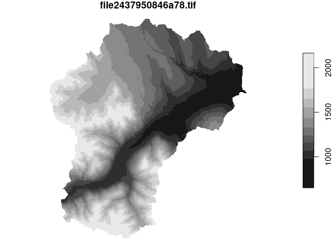
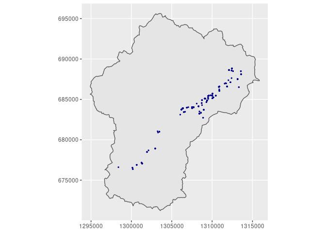

# bcaquiferdata

This is the preliminary work on a Shiny App tool for BC Gov for working
with aquifer data.

To install:

``` r
install.packages("bcaquiferdata", 
                 repos = c("https://steffilazerte.r-universe.dev", 
                           "https://cloud.r-project.org"))
```

### General Workflow

``` r
library(sf)
library(ggplot2)
library(bcaquiferdata)
```

Load a shape file defining the region of interest

``` r
creek <- st_read("misc/data/Clinton_Creek.shp")
```

    ## Reading layer `Clinton_Creek' from data source 
    ##   `/home/steffi/Projects/Business/BC Government/bcaquiferdata/misc/data/Clinton_Creek.shp' 
    ##   using driver `ESRI Shapefile'
    ## Simple feature collection with 1 feature and 15 fields
    ## Geometry type: POLYGON
    ## Dimension:     XY
    ## Bounding box:  xmin: 1294896 ymin: 671234.7 xmax: 1315854 ymax: 695645.2
    ## Projected CRS: NAD83 / BC Albers

Fetch LiDAR DEM (this may take a while the first time)

``` r
creek_lidar <- lidar_region(creek)
```

    ## Get LiDAR data

    ## Saving tiles to cache directory: ~/.local/share/bcaquiferdata

    ## Checking for matching tifs

    ## Fetching bc_092i092_xli1m_utm10_2019.tif - skipping (new_only = TRUE)

    ## Fetching bc_092p002_xli1m_utm10_2019.tif - skipping (new_only = TRUE)

    ## Fetching bc_092p003_xli1m_utm10_2019.tif - skipping (new_only = TRUE)

    ## Fetching bc_092p012_xli1m_utm10_2019.tif - skipping (new_only = TRUE)

    ## Fetching bc_092p013_xli1m_utm10_2019.tif - skipping (new_only = TRUE)

Plot to double check

``` r
plot(creek_lidar)
```

    ## downsample set to 38

<!-- -->

Collect wells in this region with added elevation from LiDAR

``` r
creek_wells <- wells_elev(creek, creek_lidar)
```

    ## Subset wells

    ## Add Lidar

Plot again to double check

``` r
ggplot() +
  geom_sf(data = creek) +
  geom_sf(data = creek_wells, size= 0.5, colour = "dark blue",
          fill="NA", show.legend = FALSE) +
 coord_sf(datum = st_crs(3005)) # BC Albers
```

<!-- -->

Export data for Strater and Voxler

``` r
wells_export(creek_wells, id = "clinton")
```

### Extra tools

``` r
library(dplyr)
library(readr)
```

Load cleaned data (will fetch if doesn’t already exist)

``` r
wells <- data_read("wells")
```

Explore the lithology standardization performed by bcaquiferdata

``` r
lith_std <- wells %>%
  select(well_tag_number, well_depth_m, contains("lith")) %>%
  arrange(!is.na(lith_category))
lith_std
```

    ## # A tibble: 564,795 × 12
    ##    well_tag_number well_depth_m aquifer_litholo… lithology_from_m lithology_to_m
    ##              <dbl>        <dbl> <chr>                       <dbl>          <dbl>
    ##  1               6        91.4  Unconsolidated               0             19.8 
    ##  2               8         3.35 Unconsolidated              NA             NA   
    ##  3              11        64.0  Bedrock                     50.0           57.0 
    ##  4              13        36.6  Unconsolidated               0.3           36.6 
    ##  5              15        53.3  Unconsolidated               0              3.05
    ##  6              15        53.3  Unconsolidated               3.05           6.71
    ##  7              15        53.3  Unconsolidated              26.8           36.3 
    ##  8              19         3.05 Unconsolidated              NA             NA   
    ##  9              25         3.66 Unconsolidated              NA             NA   
    ## 10              33        18.3  Unconsolidated              NA             NA   
    ## # … with 564,785 more rows, and 7 more variables: lithology_raw_data <chr>,
    ## #   lith_clean <chr>, lith_primary <chr>, lith_secondary <chr>,
    ## #   lith_tertiary <chr>, lith_extra <chr>, lith_category <chr>

Save it to peruse later

``` r
write_csv(lith_std, "lith_categorization.csv")
```
