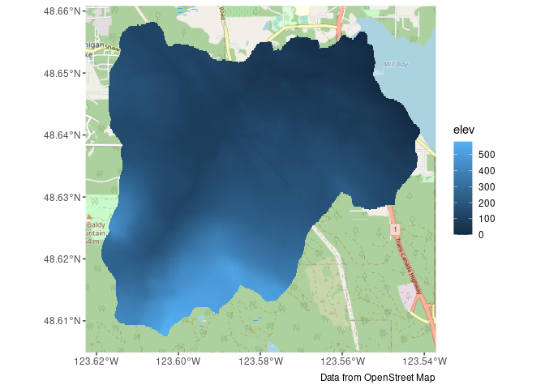

# bcaquiferdata

This is an R package for processing BC Gov GWELLS data into formats more
suitable for other analyses (e.g., Strater, Voxler, ArcHydro).

The functions provided here allow users to filter GWELLS data by region
(shapefile), calculate and add elevation data from Lidar, and clean and
categorize GWELLS lithology and yield data.

The Shiny app (a graphical user interface), provides a tool for data
exploration and exporting.

This is work is still in the preliminary stages.

To install:

``` r
install.packages("bcaquiferdata", 
                 repos = c("https://steffilazerte.r-universe.dev", 
                           "https://cloud.r-project.org"))
```

## General Workflow

### Shiny App

To run the Shiny app

``` r
aq_app()
```

### By Code

A general workflow ‘by hand’ (without using the app) is to run through
the various steps using the functions directly.

This gives you a bit more flexibility in how you explore and/or filter
your data.

Let’s work through a couple of examples.

``` r
library(sf)
library(ggplot2)
library(bcaquiferdata)
library(ggspatial)
```

#### Clinton Creek

Load a shape file defining the region of interest

``` r
creek_sf <- st_read("misc/data/Clinton_Creek.shp")
```

    ## Reading layer `Clinton_Creek' from data source 
    ##   `/home/steffi/Projects/Business/BC Government/bcaquiferdata/misc/data/Clinton_Creek.shp' 
    ##   using driver `ESRI Shapefile'
    ## Simple feature collection with 1 feature and 15 fields
    ## Geometry type: POLYGON
    ## Dimension:     XY
    ## Bounding box:  xmin: 1294896 ymin: 671234.7 xmax: 1315854 ymax: 695645.2
    ## Projected CRS: NAD83 / BC Albers

Fetch LiDAR DEM (this may take a while the first time)

``` r
creek_lidar <- lidar_region(creek_sf)
```

    ## Get LiDAR data

    ## Saving tiles to cache directory: ~/.local/share/bcaquiferdata

    ## Checking for matching tifs

    ## Fetching bc_092i092_xli1m_utm10_2019.tif - skipping (new_only = TRUE)

    ## Fetching bc_092p002_xli1m_utm10_2019.tif - skipping (new_only = TRUE)

    ## Fetching bc_092p003_xli1m_utm10_2019.tif - skipping (new_only = TRUE)

    ## Fetching bc_092p012_xli1m_utm10_2019.tif - skipping (new_only = TRUE)

    ## Fetching bc_092p013_xli1m_utm10_2019.tif - skipping (new_only = TRUE)

Plot to double check

``` r
plot(creek_lidar)
```

    ## downsample set to 38

<!-- -->

Collect wells in this region with added elevation from LiDAR

``` r
creek_wells <- creek_sf |>
  wells_subset() |>        # Subset to region
  wells_elev(creek_lidar)  # Add Lidar
```

    ## Subset wells

    ## Add Lidar

Plot again to double check

``` r
ggplot() +
  geom_sf(data = creek_sf) +
  geom_sf(data = creek_wells, size= 0.5, colour = "dark blue",
          fill="NA", show.legend = FALSE) +
 coord_sf(datum = st_crs(3005)) # BC Albers
```

<!-- -->

Export data for Strater and Voxler

``` r
wells_export(creek_wells, id = "clinton", type = "strater")
```

    ## Writing Strater files ./clinton_lith.csv, ./clinton_collars.csv, ./clinton_wls.csv

    ## [1] "./clinton_lith.csv"    "./clinton_collars.csv" "./clinton_wls.csv"

``` r
wells_export(creek_wells, id = "clinton", type = "voxler")
```

    ## [1] "./clinton_vox"

#### Mill Bay Watershed

Load a shape file defining the region of interest

``` r
mill_sf <- st_read("misc/data/MillBayWatershed.shp")
```

    ## Reading layer `MillBayWatershed' from data source 
    ##   `/home/steffi/Projects/Business/BC Government/bcaquiferdata/misc/data/MillBayWatershed.shp' 
    ##   using driver `ESRI Shapefile'
    ## Simple feature collection with 1 feature and 16 fields
    ## Geometry type: POLYGON
    ## Dimension:     XY
    ## Bounding box:  xmin: 1175893 ymin: 402094.9 xmax: 1181462 ymax: 407633.1
    ## Projected CRS: NAD83 / BC Albers

We’ll check against some tiles

``` r
g <- ggplot() +
  annotation_map_tile(type = "osm", zoomin = -1) +
  geom_sf(data = mill_sf, fill = NA, linewidth = 1.5) +
  labs(caption = "Data from OpenStreet Map")
g
```

    ## Zoom: 13

<!-- -->

Fetch LiDAR DEM (this may take a while the first time)

``` r
mill_lidar <- lidar_region(mill_sf)
```

    ## Get LiDAR data

    ## Saving tiles to cache directory: ~/.local/share/bcaquiferdata

    ## Checking for matching tifs

    ## Fetching bc_092b062_xl1m_utm10_2019.tif - skipping (new_only = TRUE)

    ## Fetching bc_092b063_xl1m_utm10_2019.tif - skipping (new_only = TRUE)

Add to our plot to double check

``` r
temp <- stars::st_downsample(mill_lidar, n = 12) %>% # Downsample first
  st_as_sf(as_points = FALSE, merge = TRUE)         # Convert to polygons
```

    ## for stars_proxy objects, downsampling only happens for dimensions x and y

``` r
g <- g + geom_sf(data = temp, aes(fill = elev), colour = NA)
g
```

    ## Zoom: 13

<!-- -->

Looks like we don’t have elevation data for the whole region. This can
be confirmed by checking the online [LidarBC
map](https://www.arcgis.com/apps/mapviewer/index.html?webmap=c2967cee749b4bdbac5e7c62935ca167)

Collect wells in this region with added elevation from LiDAR

``` r
mill_wells <- mill_sf |>
  wells_subset() |>
  wells_elev(mill_lidar)
```

    ## Subset wells

    ## Add Lidar

Plot again to double check, see the points where we don’t have elevation
data.

``` r
g +
  geom_sf(data = mill_wells, size= 1, aes(colour = is.na(elev))) +
  scale_colour_manual(values = c("white", "black"))
```

    ## Zoom: 13

<!-- -->

Export data for Strater and Voxler

``` r
wells_export(mill_wells, id = "mill", type = "strater")
```

    ## Writing Strater files ./mill_lith.csv, ./mill_collars.csv, ./mill_wls.csv

    ## [1] "./mill_lith.csv"    "./mill_collars.csv" "./mill_wls.csv"

``` r
wells_export(mill_wells, id = "mill", type = "voxler")
```

    ## [1] "./mill_vox"

### Extra tools

``` r
library(dplyr)
library(readr)
```

Load cleaned data (will fetch if doesn’t already exist)

``` r
wells_lith <- data_read("lithology", update = TRUE)
```

    ## Downloading GWELLS data

    ##   |                                                                              |                                                                      |   0%  |                                                                              |                                                                      |   1%  |                                                                              |=                                                                     |   1%  |                                                                              |=                                                                     |   2%  |                                                                              |==                                                                    |   2%  |                                                                              |==                                                                    |   3%  |                                                                              |==                                                                    |   4%  |                                                                              |===                                                                   |   4%  |                                                                              |===                                                                   |   5%  |                                                                              |====                                                                  |   5%  |                                                                              |====                                                                  |   6%  |                                                                              |=====                                                                 |   6%  |                                                                              |=====                                                                 |   7%  |                                                                              |=====                                                                 |   8%  |                                                                              |======                                                                |   8%  |                                                                              |======                                                                |   9%  |                                                                              |=======                                                               |   9%  |                                                                              |=======                                                               |  10%  |                                                                              |=======                                                               |  11%  |                                                                              |========                                                              |  11%  |                                                                              |========                                                              |  12%  |                                                                              |=========                                                             |  12%  |                                                                              |=========                                                             |  13%  |                                                                              |=========                                                             |  14%  |                                                                              |==========                                                            |  14%  |                                                                              |==========                                                            |  15%  |                                                                              |===========                                                           |  15%  |                                                                              |===========                                                           |  16%  |                                                                              |============                                                          |  16%  |                                                                              |============                                                          |  17%  |                                                                              |============                                                          |  18%  |                                                                              |=============                                                         |  18%  |                                                                              |=============                                                         |  19%  |                                                                              |==============                                                        |  19%  |                                                                              |==============                                                        |  20%  |                                                                              |==============                                                        |  21%  |                                                                              |===============                                                       |  21%  |                                                                              |===============                                                       |  22%  |                                                                              |================                                                      |  22%  |                                                                              |================                                                      |  23%  |                                                                              |=================                                                     |  24%  |                                                                              |=================                                                     |  25%  |                                                                              |==================                                                    |  25%  |                                                                              |==================                                                    |  26%  |                                                                              |===================                                                   |  26%  |                                                                              |===================                                                   |  27%  |                                                                              |===================                                                   |  28%  |                                                                              |====================                                                  |  28%  |                                                                              |====================                                                  |  29%  |                                                                              |=====================                                                 |  29%  |                                                                              |=====================                                                 |  30%  |                                                                              |=====================                                                 |  31%  |                                                                              |======================                                                |  31%  |                                                                              |======================                                                |  32%  |                                                                              |=======================                                               |  32%  |                                                                              |=======================                                               |  33%  |                                                                              |=======================                                               |  34%  |                                                                              |========================                                              |  34%  |                                                                              |========================                                              |  35%  |                                                                              |=========================                                             |  35%  |                                                                              |=========================                                             |  36%  |                                                                              |==========================                                            |  36%  |                                                                              |==========================                                            |  37%  |                                                                              |==========================                                            |  38%  |                                                                              |===========================                                           |  38%  |                                                                              |===========================                                           |  39%  |                                                                              |============================                                          |  39%  |                                                                              |============================                                          |  40%  |                                                                              |============================                                          |  41%  |                                                                              |=============================                                         |  41%  |                                                                              |=============================                                         |  42%  |                                                                              |==============================                                        |  42%  |                                                                              |==============================                                        |  43%  |                                                                              |==============================                                        |  44%  |                                                                              |===============================                                       |  44%  |                                                                              |===============================                                       |  45%  |                                                                              |================================                                      |  45%  |                                                                              |================================                                      |  46%  |                                                                              |=================================                                     |  46%  |                                                                              |=================================                                     |  47%  |                                                                              |=================================                                     |  48%  |                                                                              |==================================                                    |  48%  |                                                                              |==================================                                    |  49%  |                                                                              |===================================                                   |  49%  |                                                                              |===================================                                   |  50%  |                                                                              |===================================                                   |  51%  |                                                                              |====================================                                  |  51%  |                                                                              |====================================                                  |  52%  |                                                                              |=====================================                                 |  52%  |                                                                              |=====================================                                 |  53%  |                                                                              |======================================                                |  54%  |                                                                              |======================================                                |  55%  |                                                                              |=======================================                               |  55%  |                                                                              |=======================================                               |  56%  |                                                                              |========================================                              |  56%  |                                                                              |========================================                              |  57%  |                                                                              |========================================                              |  58%  |                                                                              |=========================================                             |  58%  |                                                                              |=========================================                             |  59%  |                                                                              |==========================================                            |  59%  |                                                                              |==========================================                            |  60%  |                                                                              |==========================================                            |  61%  |                                                                              |===========================================                           |  61%  |                                                                              |===========================================                           |  62%  |                                                                              |============================================                          |  62%  |                                                                              |============================================                          |  63%  |                                                                              |============================================                          |  64%  |                                                                              |=============================================                         |  64%  |                                                                              |=============================================                         |  65%  |                                                                              |==============================================                        |  65%  |                                                                              |==============================================                        |  66%  |                                                                              |===============================================                       |  66%  |                                                                              |===============================================                       |  67%  |                                                                              |===============================================                       |  68%  |                                                                              |================================================                      |  68%  |                                                                              |================================================                      |  69%  |                                                                              |=================================================                     |  69%  |                                                                              |=================================================                     |  70%  |                                                                              |=================================================                     |  71%  |                                                                              |==================================================                    |  71%  |                                                                              |==================================================                    |  72%  |                                                                              |===================================================                   |  72%  |                                                                              |===================================================                   |  73%  |                                                                              |===================================================                   |  74%  |                                                                              |====================================================                  |  74%  |                                                                              |====================================================                  |  75%  |                                                                              |=====================================================                 |  75%  |                                                                              |=====================================================                 |  76%  |                                                                              |======================================================                |  77%  |                                                                              |======================================================                |  78%  |                                                                              |=======================================================               |  78%  |                                                                              |=======================================================               |  79%  |                                                                              |========================================================              |  79%  |                                                                              |========================================================              |  80%  |                                                                              |========================================================              |  81%  |                                                                              |=========================================================             |  81%  |                                                                              |=========================================================             |  82%  |                                                                              |==========================================================            |  82%  |                                                                              |==========================================================            |  83%  |                                                                              |===========================================================           |  84%  |                                                                              |===========================================================           |  85%  |                                                                              |============================================================          |  85%  |                                                                              |============================================================          |  86%  |                                                                              |=============================================================         |  86%  |                                                                              |=============================================================         |  87%  |                                                                              |=============================================================         |  88%  |                                                                              |==============================================================        |  88%  |                                                                              |==============================================================        |  89%  |                                                                              |===============================================================       |  89%  |                                                                              |===============================================================       |  90%  |                                                                              |===============================================================       |  91%  |                                                                              |================================================================      |  91%  |                                                                              |================================================================      |  92%  |                                                                              |=================================================================     |  92%  |                                                                              |=================================================================     |  93%  |                                                                              |=================================================================     |  94%  |                                                                              |==================================================================    |  94%  |                                                                              |==================================================================    |  95%  |                                                                              |===================================================================   |  95%  |                                                                              |===================================================================   |  96%  |                                                                              |====================================================================  |  96%  |                                                                              |====================================================================  |  97%  |                                                                              |====================================================================  |  98%  |                                                                              |===================================================================== |  98%  |                                                                              |===================================================================== |  99%  |                                                                              |======================================================================|  99%  |                                                                              |======================================================================| 100%

    ## Wells - Cleaning

    ## Wells - Saving data to cache

    ## Lithology - Cleaning

    ## Lithology - Standardizing

    ## Lithology - Saving data to cache

Explore the lithology standardization performed by bcaquiferdata

``` r
lith_std <- wells_lith |>
  select(well_tag_number, contains("lith")) |>
  arrange(!is.na(lithology_category))
lith_std
```

    ## # A tibble: 612,193 × 17
    ##    well_tag_number lithology_from_ft_bgl lithology_to_ft_bgl lithology_raw_data 
    ##              <dbl>                 <dbl>               <dbl> <chr>              
    ##  1              11                   164                 187 "red ash"          
    ##  2              13                     1                 120 "\""               
    ##  3              49                     0                  15  <NA>              
    ##  4              62                     0                   0 "backfilled to 217…
    ##  5              73                    25                 170 "delimite w/copper…
    ##  6              73                   190                 380 "copper ore w/deli…
    ##  7              88                     0                  65  <NA>              
    ##  8              98                     0                  15  <NA>              
    ##  9             105                     0                  15  <NA>              
    ## 10             163                   200                 210 "gray,clean a litt…
    ## # ℹ 612,183 more rows
    ## # ℹ 13 more variables: lithology_description_code <chr>,
    ## #   lithology_material_code <chr>, lithology_hardness_code <chr>,
    ## #   lithology_colour_code <chr>, lithology_observation <chr>,
    ## #   lithology_from_m <dbl>, lithology_to_m <dbl>, lithology_clean <chr>,
    ## #   lith_primary <chr>, lith_secondary <chr>, lith_tertiary <chr>,
    ## #   lithology_extra <chr>, lithology_category <chr>

Save it to peruse later

``` r
write_csv(lith_std, "lith_categorization.csv")
```
