This article presents a couple examples of general workflows in R alone
(without using the Shiny app), running through the various steps using the functions directly.

This gives you a bit more flexibility in how you explore and/or filter your
data.

Note that we also show different ways of plotting the various datasets.
Pick that which works best for you!

Let's work through a couple of examples (note these examples are presented for illustration, but 
the shape files are not included in the package).

## Setup

``` r
library(bcaquiferdata)
library(stars) # For working with raster
library(sf) # For working with spatial vectors
library(ggplot2) # For plotting
library(ggspatial) # For plotting with map tiles
```

## Example 1: Clinton Creek (Lidar)

### Load shapefile
Load a shape file defining the region of interest

``` r
creek_sf <- st_read("misc/data/Clinton_Creek.shp")
```

### Add elevation
Fetch Lidar DEM (this may take a while the first time)


``` r
creek_lidar <- dem_region(creek_sf)
#> Get Lidar data
#> Saving new tiles to cache directory: ~/.local/share/bcaquiferdata
#> Checking for matching tifs
#> Fetching bc_092p002_xli1m_utm10_2019.tif - skipping (new_only = TRUE)
#> Fetching bc_092p013_xli1m_utm10_2019.tif - skipping (new_only = TRUE)
#> Fetching bc_092p012_xli1m_utm10_2019.tif - skipping (new_only = TRUE)
#> Fetching bc_092i092_xli1m_utm10_2019.tif - skipping (new_only = TRUE)
#> Fetching bc_092p003_xli1m_utm10_2019.tif - skipping (new_only = TRUE)
#> Cropping DEM to region
```

Plot to double check

``` r
plot(creek_lidar)
#> downsample set to 44
```

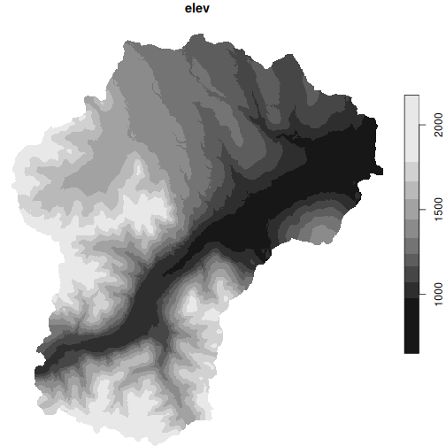

Collect wells in this region with added elevation from Lidar


``` r
creek_wells <- creek_sf |>
  wells_subset() |> # Subset to region
  wells_elev(creek_lidar) # Add Lidar
#> Subset wells
#> Fixing wells with a bottom lithology interval of zero thickness: 37685
#> Fixing wells where yield 0 should be NA: 4235, 44960, 57075, 57950, 75863
#> Add elevation
```

Plot again to double check

``` r
ggplot() +
  geom_sf(data = creek_sf) +
  geom_sf(data = creek_wells, size = 1, aes(colour = elev))
```

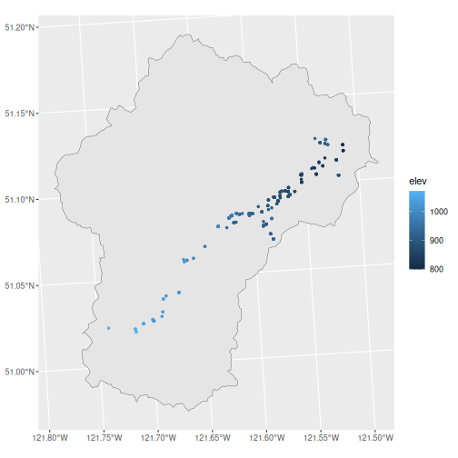

### Export
Export data for Strater, Voxler, and ArcHydro

``` r
wells_export(creek_wells, id = "clinton", type = "strater")
#> Writing Strater file(s) ./clinton_strater_lith.csv, ./clinton_strater_collars.csv, ./clinton_strater_wls.csv
#> [1] "./clinton_strater_lith.csv"    "./clinton_strater_collars.csv"
#> [3] "./clinton_strater_wls.csv"
wells_export(creek_wells, id = "clinton", type = "voxler")
#> Writing Voxler file(s) ./clinton_voxler.csv
#> [1] "./clinton_voxler.csv"
wells_export(creek_wells, id = "clinton", type = "archydro")
#> Writing ArcHydro file(s) ./clinton_archydro_well.csv, ./clinton_archydro_hguid.csv, ./clinton_archydro_bh.csv
#> [1] "./clinton_archydro_well.csv"  "./clinton_archydro_hguid.csv"
#> [3] "./clinton_archydro_bh.csv"
```

If we want to export the Lidar DEM file cropped to the watershed, we can use `write_stars()`, but up until now we've been using stars proxy objects, so doing this will take a **long** time.


``` r
write_stars(creek_lidar, "clinton_lidar_dem.tif", progress = TRUE)
```

A better option is to use `dem_region()` with the `out_file` argument.
This leverages `sf::gdal_utils()` to use the local gdal software directly which 
is much faster.


``` r
dem_region(creek_sf, out_file = "clinton_lidar_dem.tif")
#> Get Lidar data
#> Saving new tiles to cache directory: ~/.local/share/bcaquiferdata
#> Checking for matching tifs
#> Fetching bc_092p002_xli1m_utm10_2019.tif - skipping (new_only = TRUE)
#> Fetching bc_092p013_xli1m_utm10_2019.tif - skipping (new_only = TRUE)
#> Fetching bc_092p012_xli1m_utm10_2019.tif - skipping (new_only = TRUE)
#> Fetching bc_092i092_xli1m_utm10_2019.tif - skipping (new_only = TRUE)
#> Fetching bc_092p003_xli1m_utm10_2019.tif - skipping (new_only = TRUE)
#> Cropping DEM to region
#> Creating local dem 'clinton_lidar_dem.tif', this may take a while...
#>   Saving region shape to temp...
#>   Creating DEM...
#>   DEM created: clinton_lidar_dem.tif
#> stars_proxy object with 1 attribute in 1 file(s):
#> $elev
#> [1] "clinton_lidar_dem.tif"
#> 
#> dimension(s):
#>   from    to  offset delta                       refsys point x/y
#> x    1 21366  585093     1 North_American_1983_CSRS_... FALSE [x]
#> y    1 24694 5672060    -1 North_American_1983_CSRS_... FALSE [y]
```

## Example 2: Mill Bay Watershed (TRIM)

### Load shapefile

Load a shape file defining the region of interest

``` r
mill_sf <- st_read("misc/data/MillBayWatershed.shp")
```

We'll check against some tiles

``` r
g <- ggplot() +
  annotation_map_tile(type = "osm", zoomin = -1) +
  geom_sf(data = mill_sf, fill = NA, linewidth = 1.5) +
  labs(caption = "Data from OpenStreet Map")
g
```

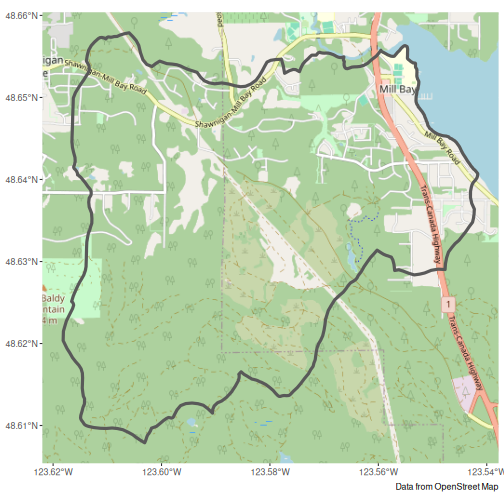

### Add elevation
Fetch Lidar DEM (this may take a while the first time)


``` r
mill_lidar <- dem_region(mill_sf)
#> Get Lidar data
#> Saving new tiles to cache directory: ~/.local/share/bcaquiferdata
#> Checking for matching tifs
#> Fetching bc_092b063_xl1m_utm10_2019.tif - skipping (new_only = TRUE)
#> Fetching bc_092b062_xl1m_utm10_2019.tif - skipping (new_only = TRUE)
#> Cropping DEM to region
```

Add to our plot to double check

``` r
mill_lidar_sf <- stars::st_downsample(mill_lidar, n = 12) |> # Downsample first
  st_as_sf(as_points = FALSE, merge = TRUE) # Convert to polygons
#> for stars_proxy objects, downsampling only happens for dimensions x and y

g + geom_sf(data = mill_lidar_sf, aes(fill = elev), colour = NA)
#> Zoom: 13
```

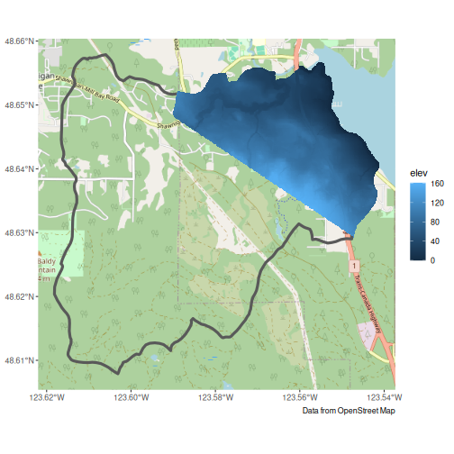

Looks like we don't have elevation data for the whole region. 
This can be confirmed by checking the online [LidarBC map](https://governmentofbc.maps.arcgis.com/apps/MapSeries/index.html?appid=d06b37979b0c4709b7fcf2a1ed458e03).

Let's take a look our our options using TRIM data.

``` r
mill_trim <- dem_region(mill_sf, source = "trim")
#> Get TRIM data
#> checking your existing tiles for mapsheet 92b are up to date
#> Cropping DEM to region
```

Add to our plot to double check

``` r
mill_trim_sf <- mill_trim |>
  st_as_sf(as_points = FALSE, merge = TRUE) # Convert to polygons

g + geom_sf(data = mill_trim_sf, aes(fill = elev), colour = NA)
#> Zoom: 13
```

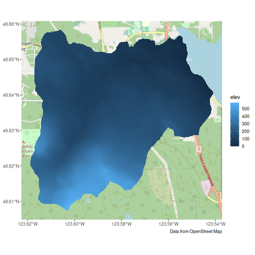

TRIM is at a coarser resolution, but covers our entire area. Let's use it instead.

Collect wells in this region with added elevation from TRIM.


``` r
mill_wells <- mill_sf |>
  wells_subset() |>
  wells_elev(mill_trim)
#> Subset wells
#> Fixing wells with a bottom lithology interval of zero thickness: 8966, 29709, 36777, 37733, 48853, 48941, 55042, 56015, 56016, 68632, 69137, 69139, 69141, 75028, 75042, 84493, 84495, 84496, 84498, 84499, 84503, 84536
#> Fixing wells missing depth: 80040, 80041, 80043, 81555, 88357, 94353, 94356
#> Fixing wells where yield 0 should be NA: 8076, 8119, 8175, 8940, 8966, 14047, 14281, 21993, 29560, 29564, 29566, 29567, 35727, 36730, 36913, 36914, 36915, 42741, 53169, 54308, 55393, 64033, 75052, 80040, 80041, 80043
#> Add elevation
```

Plot again to double check, see that we now elevation data for all wells.

``` r
g +
  geom_sf(data = mill_wells, size = 1, aes(colour = elev)) +
  scale_color_viridis_c(na.value = "red")
#> Zoom: 13
```

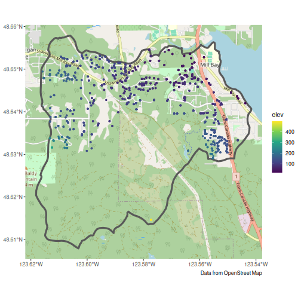

### Export
Export data for Strater, Voxler, and ArcHydro

``` r
wells_export(mill_wells, id = "mill", type = "strater")
#> Writing Strater file(s) ./mill_strater_lith.csv, ./mill_strater_collars.csv, ./mill_strater_wls.csv
#> [1] "./mill_strater_lith.csv"    "./mill_strater_collars.csv"
#> [3] "./mill_strater_wls.csv"
wells_export(mill_wells, id = "mill", type = "voxler")
#> Writing Voxler file(s) ./mill_voxler.csv
#> [1] "./mill_voxler.csv"
wells_export(mill_wells, id = "mill", type = "archydro")
#> Writing ArcHydro file(s) ./mill_archydro_well.csv, ./mill_archydro_hguid.csv, ./mill_archydro_bh.csv
#> [1] "./mill_archydro_well.csv"  "./mill_archydro_hguid.csv"
#> [3] "./mill_archydro_bh.csv"
```

As with Clinton Creek, if we want to export the TRIM DEM file cropped to the watershed, we can use `write_stars()`, but up until now we've been using stars proxy objects, so doing this could take a **long** time.


``` r
write_stars(mill_trim, "mill_trim_dem.tif", progress = TRUE)
```

A better option is to use `dem_region()` with the `out_file` argument.
This leverages `sf::gdal_utils()` to use the local gdal software directly which 
is much faster.


``` r
dem_region(mill_sf, out_file = "mill_trim_dem.tif")
#> Get Lidar data
#> Saving new tiles to cache directory: ~/.local/share/bcaquiferdata
#> Checking for matching tifs
#> Fetching bc_092b063_xl1m_utm10_2019.tif - skipping (new_only = TRUE)
#> Fetching bc_092b062_xl1m_utm10_2019.tif - skipping (new_only = TRUE)
#> Cropping DEM to region
#> Creating local dem 'mill_trim_dem.tif', this may take a while...
#>   Saving region shape to temp...
#>   Creating DEM...
#>   DEM created: mill_trim_dem.tif
#> stars_proxy object with 1 attribute in 1 file(s):
#> $elev
#> [1] "mill_trim_dem.tif"
#> 
#> dimension(s):
#>   from   to  offset delta                     refsys point x/y
#> x    1 5742  454400     1 NAD83(CSRS) / UTM zone 10N FALSE [x]
#> y    1 5648 5389647    -1 NAD83(CSRS) / UTM zone 10N FALSE [y]
```

## Example 3: Koksilah Watershed (Combinations and Custom DEM)

### Load shapefile
Load a shape file defining the region of interest

``` r
koksilah_sf <- st_read("misc/data/Koksilah_watershed4/Koksilah_watershed4.shp")
```


### Add elevation
Fetch Lidar DEM (this may take a while the first time)


``` r
koksilah_lidar <- dem_region(koksilah_sf)
#> Get Lidar data
#> Saving new tiles to cache directory: ~/.local/share/bcaquiferdata
#> Checking for matching tifs
#> Fetching bc_092b063_xl1m_utm10_2019.tif - skipping (new_only = TRUE)
#> Fetching bc_092b062_xl1m_utm10_2019.tif - skipping (new_only = TRUE)
#> Fetching bc_092b073_xl1m_utm10_2019.tif - skipping (new_only = TRUE)
#> Fetching bc_092b072_xl1m_utm10_2019.tif - skipping (new_only = TRUE)
#> Fetching bc_092b071_xl1m_utm10_2019.tif - skipping (new_only = TRUE)
#> Cropping DEM to region
```

Plot to double check. Hmm, we only have some Lidar

``` r
plot(koksilah_lidar, reset = FALSE)
#> downsample set to 45
plot(
  st_transform(koksilah_sf, crs = st_crs(koksilah_lidar)),
  add = TRUE,
  border = "red",
  col = NA
)
```

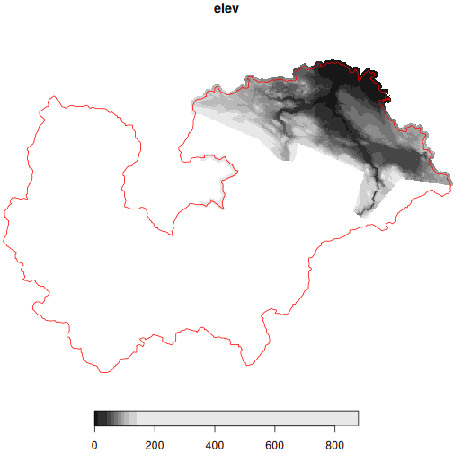

We could use TRIM instead.


``` r
koksilah_trim <- dem_region(koksilah_sf, source = "trim")
#> Get TRIM data
#> checking your existing tiles for mapsheet 92b are up to date
#> Cropping DEM to region
```


``` r
plot(koksilah_trim, reset = FALSE)
#> downsample set to 1
plot(
  st_transform(koksilah_sf, crs = st_crs(koksilah_trim)),
  add = TRUE,
  border = "red",
  col = NA
)
```

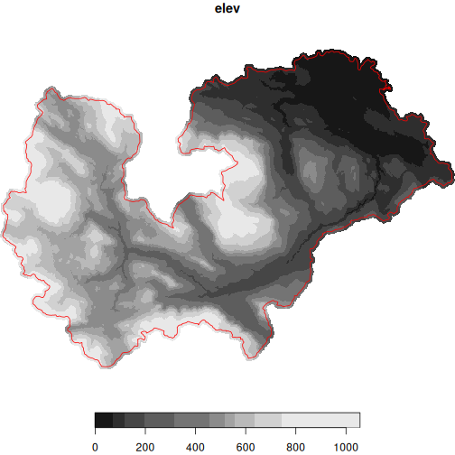

But the TRIM resolution is lower than Lidar.

We could also use Lidar where we have it and TRIM for the rest. But be careful! 
Combining different sources could result in artifacts unrelated to actual elevation differences and simply to methodology.

Here we'll provide the TRIM DEM as `dem_extra`, so the Lidar DEM takes priority.


``` r
koksilah_wells <- koksilah_sf |>
  wells_subset() |> # Subset to region
  wells_elev(dem = koksilah_lidar, dem_extra = koksilah_trim) # Add Lidar and TRIM
#> Subset wells
#> Fixing wells with a bottom lithology interval of zero thickness: 508, 510, 520, 898, 903, 1324, 4104, 8182, 14557, 14809, 16103, 17613, 19087, 22200, 24565, 24607, 24704, 24716, 26135, 26262, 26715, 28088, 28230, 29932, 29946, 31711, 32166, 33042, 33481, 35250, 39644, 41549, 42579, 42610, 42870, 42902, 43240, 43679, 43693, 43706, 43707, 44175, 44635, 44892, 45171, 47863, 48136, 48489, 48802, 48997, 51101, 51120, 51848, 52005, 52666, 53308, 53860, 54536, 54610, 54611, 55154, 55461, 55544, 55754, 55828, 55840, 56066, 56264, 63024, 63137, 63432, 63469, 63474, 63482, 63565, 63623, 63647, 63853, 63854, 63857, 63858, 64045, 64076, 64106, 64117, 64134, 64203, 65065, 65077, 68672, 68677, 68689, 68982, 68984, 68992, 69019, 69025, 69195, 69216, 69228, 74407, 74936, 75013, 75014, 75048, 80090, 84512, 84799, 85462, 86986, 88812, 96112, 96612, 100459, 104509, 108427, 110070, 113360, 113806, 117334, 117428, 117430, 118676, 119108, 120148, 121387, 128474, 130757, 134329
#> Fixing wells missing depth: 88360, 88478, 91273, 91275, 96303, 96307, 100813, 103048, 107303, 108625, 111962
#> Fixing wells where yield 0 should be NA: 518, 522, 903, 1324, 1724, 4054, 4056, 4061, 4066, 4072, 4073, 4087, 4098, 4103, 4104, 4109, 4110, 4116, 4126, 4130, 4137, 4139, 4169, 4185, 4187, 4196, 4208, 4219, 4227, 4230, 7454, 8929, 8977, 8979, 8982, 8984, 8985, 8986, 8991, 8995, 13830, 19325, 21535, 21596, 23415, 23725, 24502, 24549, 26134, 26135, 26519, 26584, 26587, 27151, 27259, 29401, 29550, 30430, 30431, 30432, 30455, 31709, 32449, 33342, 33367, 35880, 36960, 39341, 39404, 41549, 42429, 42431, 43231, 43728, 44012, 44174, 44176, 44178, 44293, 44309, 48237, 51120, 51240, 53193, 53194, 55146, 55147, 55189, 55516, 55679, 56217, 63059, 63427, 63452, 63516, 63565, 63983, 64005, 64009, 64010, 64045, 64057, 64098, 64114, 65006, 65064, 68694, 68695, 68797, 69013, 69019, 69210, 70902, 74586, 75014, 77082, 81870, 81908, 117559, 121933, 121934, 133785
#> Add elevation
#> Warning: Combining elevations measured through different techniques may introduce
#> artifacts into your measure of elevation. Use with caution.
```

Plot to check elevations

``` r
ggplot() +
  geom_sf(data = koksilah_sf) +
  geom_sf(data = koksilah_wells, size = 1, aes(colour = elev))
```

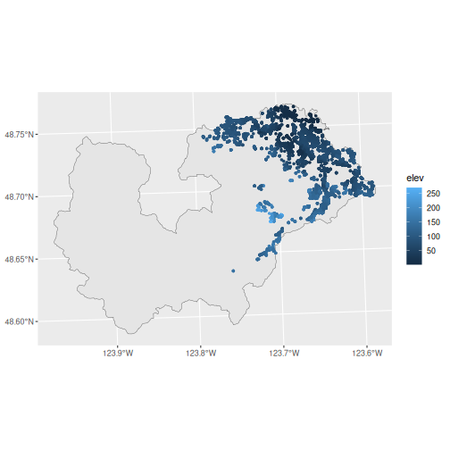


And finally, perhaps it's best if we source our own, complete DEM file.


```
#> Load local DEM
#> Cropping DEM to region
```


``` r
koksilah_custom <- dem_region(
  koksilah_sf,
  source = "misc/data/Koksilah_Watershed_DEM_2km_Buffer.tif"
)
```


``` r
plot(koksilah_custom, reset = FALSE)
#> downsample set to 47
plot(
  st_transform(koksilah_sf, crs = st_crs(koksilah_custom)),
  add = TRUE,
  border = "red",
  col = NA
)
```

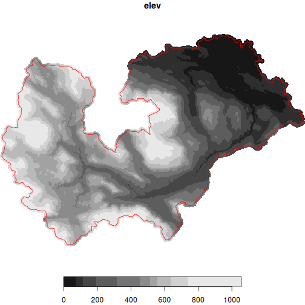


``` r
koksilah_wells <- koksilah_sf |>
  wells_subset() |> # Subset to region
  wells_elev(dem = koksilah_custom) # Add Custom DEM
#> Subset wells
#> Fixing wells with a bottom lithology interval of zero thickness: 508, 510, 520, 898, 903, 1324, 4104, 8182, 14557, 14809, 16103, 17613, 19087, 22200, 24565, 24607, 24704, 24716, 26135, 26262, 26715, 28088, 28230, 29932, 29946, 31711, 32166, 33042, 33481, 35250, 39644, 41549, 42579, 42610, 42870, 42902, 43240, 43679, 43693, 43706, 43707, 44175, 44635, 44892, 45171, 47863, 48136, 48489, 48802, 48997, 51101, 51120, 51848, 52005, 52666, 53308, 53860, 54536, 54610, 54611, 55154, 55461, 55544, 55754, 55828, 55840, 56066, 56264, 63024, 63137, 63432, 63469, 63474, 63482, 63565, 63623, 63647, 63853, 63854, 63857, 63858, 64045, 64076, 64106, 64117, 64134, 64203, 65065, 65077, 68672, 68677, 68689, 68982, 68984, 68992, 69019, 69025, 69195, 69216, 69228, 74407, 74936, 75013, 75014, 75048, 80090, 84512, 84799, 85462, 86986, 88812, 96112, 96612, 100459, 104509, 108427, 110070, 113360, 113806, 117334, 117428, 117430, 118676, 119108, 120148, 121387, 128474, 130757, 134329
#> Fixing wells missing depth: 88360, 88478, 91273, 91275, 96303, 96307, 100813, 103048, 107303, 108625, 111962
#> Fixing wells where yield 0 should be NA: 518, 522, 903, 1324, 1724, 4054, 4056, 4061, 4066, 4072, 4073, 4087, 4098, 4103, 4104, 4109, 4110, 4116, 4126, 4130, 4137, 4139, 4169, 4185, 4187, 4196, 4208, 4219, 4227, 4230, 7454, 8929, 8977, 8979, 8982, 8984, 8985, 8986, 8991, 8995, 13830, 19325, 21535, 21596, 23415, 23725, 24502, 24549, 26134, 26135, 26519, 26584, 26587, 27151, 27259, 29401, 29550, 30430, 30431, 30432, 30455, 31709, 32449, 33342, 33367, 35880, 36960, 39341, 39404, 41549, 42429, 42431, 43231, 43728, 44012, 44174, 44176, 44178, 44293, 44309, 48237, 51120, 51240, 53193, 53194, 55146, 55147, 55189, 55516, 55679, 56217, 63059, 63427, 63452, 63516, 63565, 63983, 64005, 64009, 64010, 64045, 64057, 64098, 64114, 65006, 65064, 68694, 68695, 68797, 69013, 69019, 69210, 70902, 74586, 75014, 77082, 81870, 81908, 117559, 121933, 121934, 133785
#> Add elevation
```

Plot to check elevations

``` r
ggplot() +
  geom_sf(data = koksilah_sf) +
  geom_sf(data = koksilah_wells, size = 1, aes(colour = elev))
```

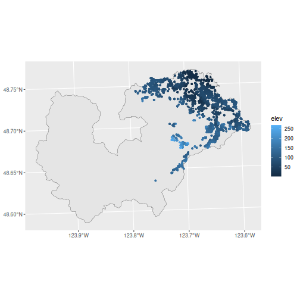

### Export
Export data for Strater, Voxler, and ArcHydro

``` r
wells_export(koksilah_wells, id = "koksilah", type = "strater")
#> Writing Strater file(s) ./koksilah_strater_lith.csv, ./koksilah_strater_collars.csv, ./koksilah_strater_wls.csv
#> [1] "./koksilah_strater_lith.csv"    "./koksilah_strater_collars.csv"
#> [3] "./koksilah_strater_wls.csv"
wells_export(koksilah_wells, id = "koksilah", type = "voxler")
#> Writing Voxler file(s) ./koksilah_voxler.csv
#> [1] "./koksilah_voxler.csv"
wells_export(koksilah_wells, id = "koksilah", type = "archydro")
#> Writing ArcHydro file(s) ./koksilah_archydro_well.csv, ./koksilah_archydro_hguid.csv, ./koksilah_archydro_bh.csv
#> [1] "./koksilah_archydro_well.csv"  "./koksilah_archydro_hguid.csv"
#> [3] "./koksilah_archydro_bh.csv"
```

If we want to export any of the downloaded DEM files cropped to the watershed, we can use `write_stars()`, but up until now we've been using stars proxy objects, so doing this will take a **long** time.


``` r
write_stars(koksilah_lidar, "koksilah_lidar_dem.tif", progress = TRUE)
write_stars(koksilah_trim, "koksilah_trim_dem.tif", progress = TRUE)
```

A better option is to use `dem_region()` with the `out_file` argument.
This leverages `sf::gdal_utils()` to use the local gdal software directly which 
is much faster.


``` r
dem_region(koksilah_sf, source = "lidar", out_file = "koksilah_lidar_dem.tif")
#> Get Lidar data
#> Saving new tiles to cache directory: ~/.local/share/bcaquiferdata
#> Checking for matching tifs
#> Fetching bc_092b063_xl1m_utm10_2019.tif - skipping (new_only = TRUE)
#> Fetching bc_092b062_xl1m_utm10_2019.tif - skipping (new_only = TRUE)
#> Fetching bc_092b073_xl1m_utm10_2019.tif - skipping (new_only = TRUE)
#> Fetching bc_092b072_xl1m_utm10_2019.tif - skipping (new_only = TRUE)
#> Fetching bc_092b071_xl1m_utm10_2019.tif - skipping (new_only = TRUE)
#> Cropping DEM to region
#> Creating local dem 'koksilah_lidar_dem.tif', this may take a while...
#>   Saving region shape to temp...
#>   Creating DEM...
#>   DEM created: koksilah_lidar_dem.tif
#> stars_proxy object with 1 attribute in 1 file(s):
#> $elev
#> [1] "koksilah_lidar_dem.tif"
#> 
#> dimension(s):
#>   from    to  offset delta                     refsys point x/y
#> x    1 29072  428186     1 NAD83(CSRS) / UTM zone 10N FALSE [x]
#> y    1 20273 5402119    -1 NAD83(CSRS) / UTM zone 10N FALSE [y]
dem_region(koksilah_sf, source = "trim", out_file = "koksilah_trim_dem.tif")
#> Get TRIM data
#> checking your existing tiles for mapsheet 92b are up to date
#> Cropping DEM to region
#> Creating local dem 'koksilah_trim_dem.tif', this may take a while...
#>   Saving region shape to temp...
#>   Creating DEM...
#>   DEM created: koksilah_trim_dem.tif
#> stars_proxy object with 1 attribute in 1 file(s):
#> $elev
#> [1] "koksilah_trim_dem.tif"
#> 
#> dimension(s):
#>   from   to offset      delta refsys point x/y
#> x    1 1893   -124  0.0002083  NAD83 FALSE [x]
#> y    1  881  48.77 -0.0002083  NAD83 FALSE [y]
```


## Extra tools


``` r
library(dplyr)
library(readr)
```


Load cleaned data (will fetch if doesn't already exist)


``` r
wells_lith <- data_read("lithology")
```

Explore the lithology standardization performed by bcaquiferdata


``` r
lith_std <- wells_lith |>
  select(well_tag_number, contains("lith")) |>
  arrange(!is.na(lithology_category))
lith_std
#> # A tibble: 638,506 × 23
#>    well_tag_number lithology_from_ft_bgl lithology_to_ft_bgl lithology_raw_data     
#>              <dbl>                 <dbl>               <dbl> <chr>                  
#>  1              11                   164                 187 "red ash"              
#>  2              13                     1                 120 "\""                   
#>  3              49                     0                  15 ""                     
#>  4              62                     0                   0 "backfilled to 217 foo…
#>  5              73                    25                 170 "delimite w/copper ore"
#>  6              73                   190                 380 "copper ore w/delimite"
#>  7              88                     0                  65 ""                     
#>  8              98                     0                  15 ""                     
#>  9             105                     0                  15 ""                     
#> 10             163                   200                 210 "gray,clean a little c…
#> # ℹ 638,496 more rows
#> # ℹ 19 more variables: lithology_description_code <chr>,
#> #   lithology_material_code <chr>, lithology_hardness_code <chr>,
#> #   lithology_colour_code <chr>, lithology_observation <chr>,
#> #   lithology_from_m <dbl>, lithology_to_m <dbl>, lithology_raw_combined <chr>,
#> #   lith_n <int>, lith_rec <int>, flag_lith_nodepths <lgl>,
#> #   flag_lith_overruns <lgl>, flag_lith_intervals <lgl>, lithology_clean <chr>, …
```

Save it to peruse later

``` r
write_csv(lith_std, "lith_categorization.csv")
```


