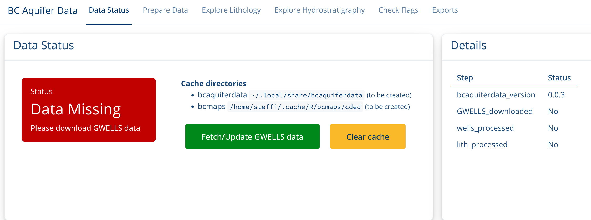
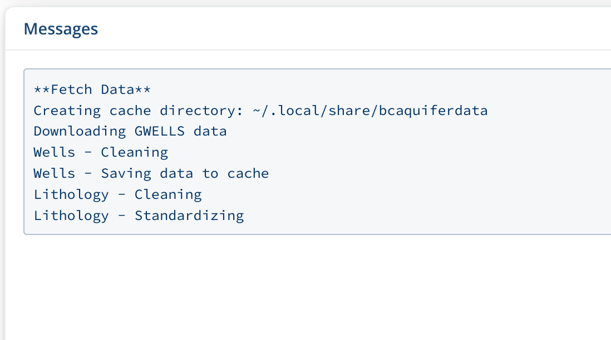
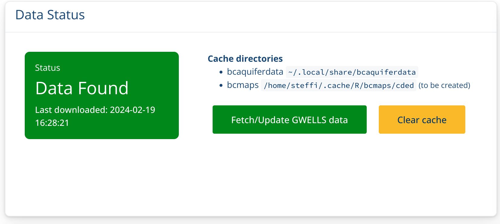
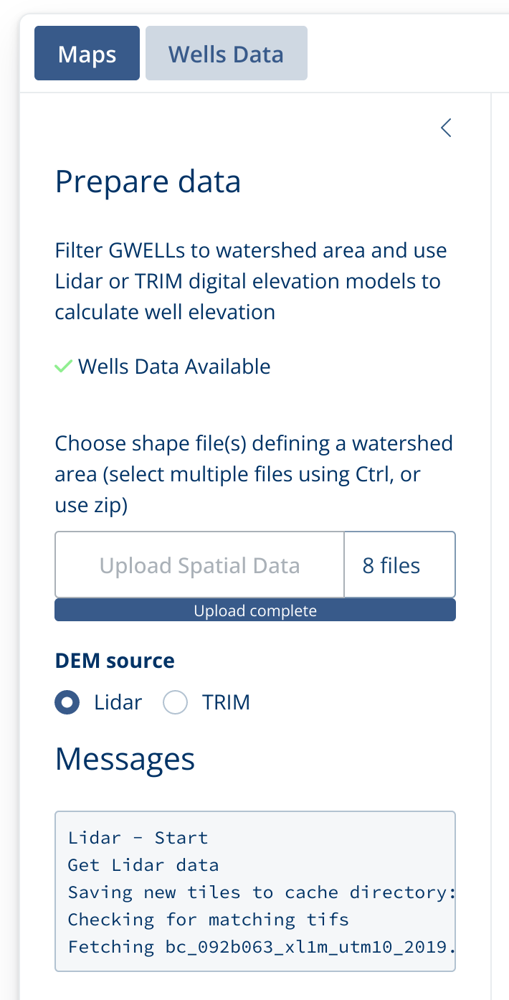
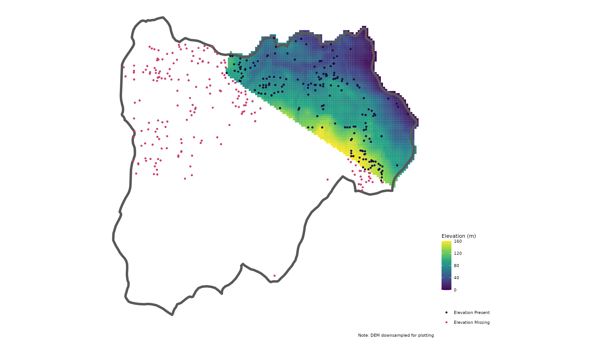
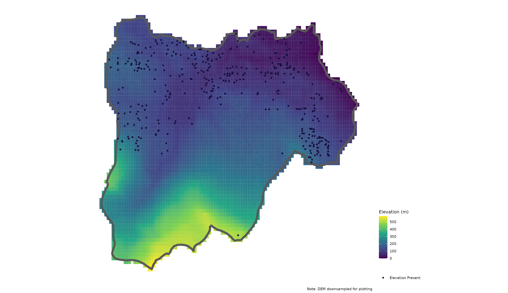
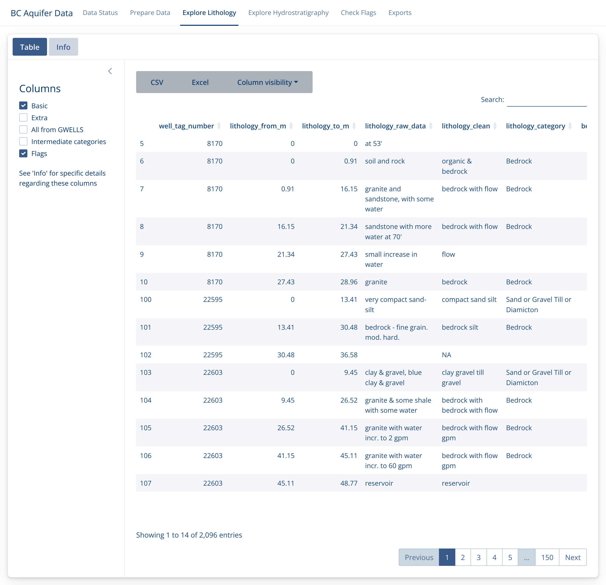
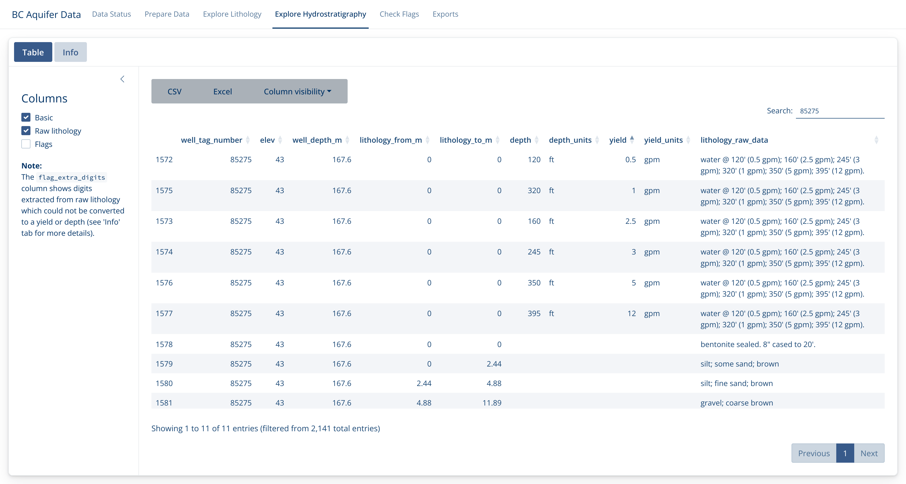
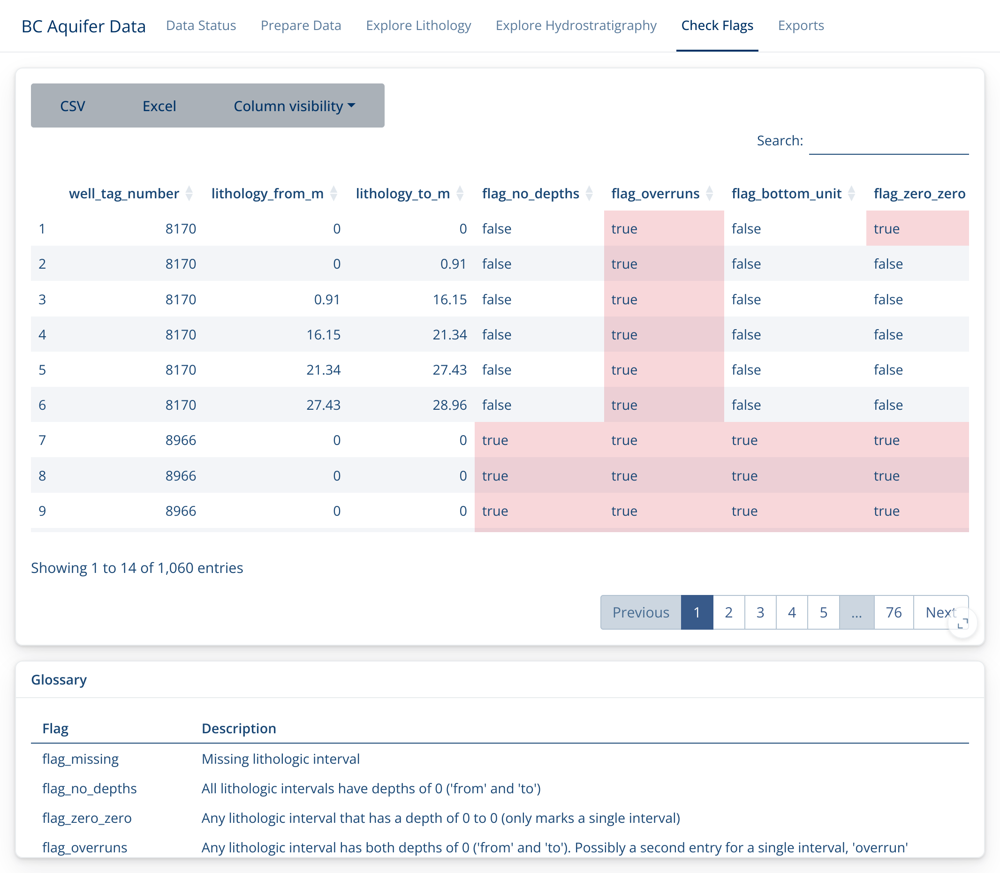
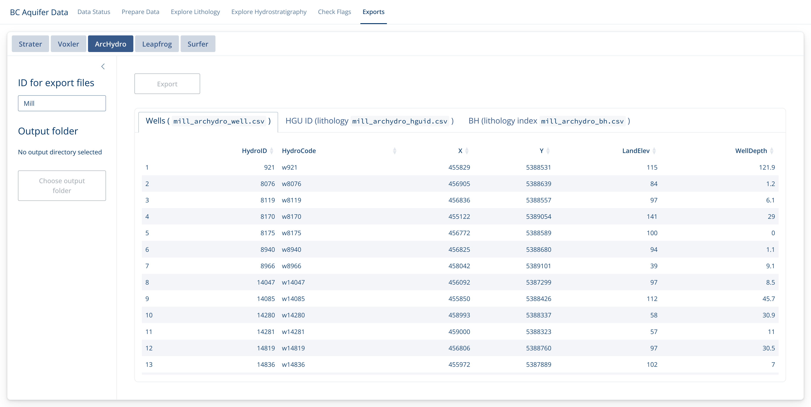

```{r, include = FALSE}
knitr::opts_chunk$set(
  collapse = TRUE,
  comment = "#>",
  fig.align = "center",
  out.width = "80%",
  echo = FALSE
)

library(knitr)
```

This Shiny App helps with working with Aquifer data, particularly in preparing it for use by other hydrology programs. 
Using this app you can filter GWELLS data to a specific area, add elevation calculated from Lidar or TRIM data, 
and incorporate lithology categorized from well descriptions.

## Opening the App

In the R console type the following, hitting enter after the line. This will launch the Shiny App.

```{r}
#| echo: true
#| eval: false
bcaquiferdata::aq_app()
```


## Data Status

The first time you launch the Shiny App your local GWELLS data will likely be out of date (or non-existent).

```{r}

```


Click on **Fetch/Update GWELLS data** to download the most recent GWELLS data. You will see a progress messages the "Messages box". If you look at the R console, you will see the progress bar advance. 

```{r}

```


This may take a little while, but once the Status box turns Green, you're ready to go!
```{r}

```


## Prepare data

Now you can add a geographic shape file which will be used to filter the well data to a particular region.
You can upload the collection of files (including .shp, .prj, etc.) or you can update a zip file of all the files together. 

Once you add your shape file, the app will automatically start downloading Lidar tiles to match that particular region.

```{r}
#| out-width: 40%

```

Once the download is finished, the watershed map with Wells and Lidar Elevation will be displayed.

```{r}

```

If you do not have sufficient Lidar coverage, you can also work with TRIM data by clicking on the TRIM radio button. 
This will then download TRIM CDED tiles.

```{r}

```

Now that we have filtered the wells data to our region and added the elevation data we can take a look 
at the other aspects of the GWELLS data.

### Explore Lithology

First we'll take a look at the lithology. 
These data (`lithology_clean` and `lithology_category`) are categorized from the 
raw GWELLS lithology descriptions (`lithology_raw_combined`, which is a 
combination of the original `lithology_raw_data`, `lithology_description_code` 
and `lithology_material_code` columns) and refer to lithology for different 
sections of a well.

See the "Info" tab for more details on what these columns are and the "Lithology Cleaning and Categorizing" article for more details on how these are created.

You can explore more columns by choosing which to include on the left side bar, as well
as by hiding/showing specific columns with the "Column visibility" menu bar.

```{r}

```

### Explore Hydrostratigraphy

Similarly, we can explore the Hydrostratigraphy. 
These values are also extracted from lithology, but specifically deal with water flow observations at different depths. 

In this example, we have extracted 6 flow measures for 6 different depths from one lithology description. 

```{r}

```

The plan is to incorporate these flow values into the exports for use in different programs, but this aspect is currently still under development.

### Check Flags

Because this work entails automated extracts and categorizations of human-entered data, there can be
mistakes in both the data entry and the data extraction phases. 
Data records are 'flagged' if they seem problematic for some reason. 
Sometimes this will be because there is an error in the data record (i.e. `falg_no_depth` highlights
lithology records without depth measurements) and sometimes they may indicate a problem in the extraction.

It is important to peruse the flags in this section, fix any you can in the original
GWELLS data base, and let us know if you find any that reflect a problem in the categorization
of the raw data.

Note that if you click in the lower right corner of the flag descriptions, you can expand it out for better reading.


```{r}

```


### Exports

Finally, if you're satisfied with the quality of your data, you can export it for use in Strater, Voxler, ArcHydro, Leapfrog or Surfer.

In each case, decide what it should be called (ID), where it should go (Output folder), and what format (click on the tab at the top). Then check the preview data and export if it looks good!

Note that this will usually create a collection of files.

```{r}

```

Enjoy! 

Be sure to let us know if there is functionality you would like to see, or if there are
any problems you find.


```
# Copyright 2024 Province of British Columbia
# 
# Licensed under the Apache License, Version 2.0 (the "License");
# you may not use this file except in compliance with the License.
# You may obtain a copy of the License at 
# 
# http://www.apache.org/licenses/LICENSE-2.0
# 
# Unless required by applicable law or agreed to in writing, software
# distributed under the License is distributed on an "AS IS" BASIS,
# WITHOUT WARRANTIES OR CONDITIONS OF ANY KIND, either express or implied.
# See the License for the specific language governing permissions and
# limitations under the License.
```
